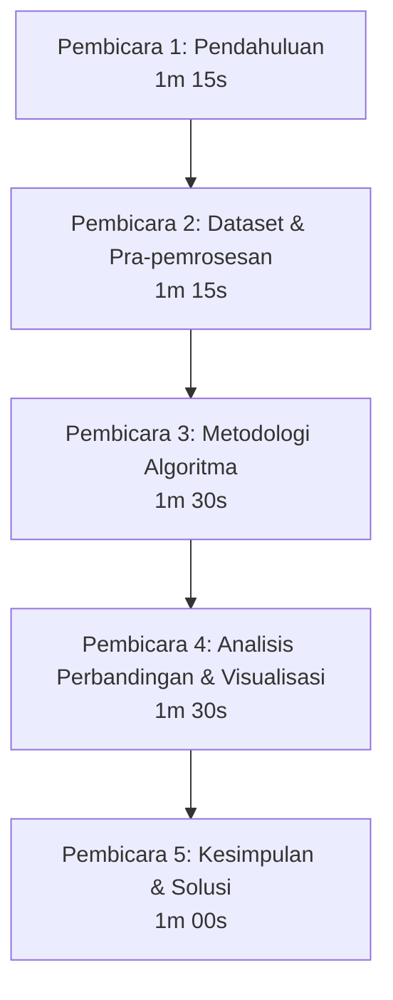

# 🌾 PANDUAN PRESENTASI: KLASIFIKASI PENYAKIT DAUN PADI DENGAN MACHINE LEARNING & DEEP LEARNING

Selamat datang di repositori panduan presentasi kelompok. Dokumen ini dirancang sebagai acuan teknis dan naskah presentasi untuk **5 orang** dengan estimasi durasi total **6–7 menit**. 

Studi kasus ini membandingkan performa tiga algoritma populer dalam mendeteksi dan mengklasifikasikan penyakit daun padi: **Convolutional Neural Network (CNN)**, **Random Forest (RF)**, dan **Support Vector Machine (SVM)**.

---

## 📊 Ringkasan Eksekutif Performa Model

Sebelum memulai presentasi, berikut adalah data performa model berdasarkan hasil pengujian yang terekam dalam gambar folder ini:

| Algoritma | Akurasi Uji / Validasi | Durasi Training | Keterangan / Karakteristik |
| :--- | :---: | :---: | :--- |
| **CNN** (Deep Learning) | **85.16%** | ~8–10 menit (20 Epoch) | **Model Terbaik**. Mengekstrak fitur spasial secara otomatis langsung dari piksel daun. |
| **Random Forest** (200 Trees) | **80.92%** | **73.97 detik** | **Sangat Efisien**. Berbasis ensemble decision trees, waktu training cepat dengan akurasi tinggi. |
| **SVM** (RBF Kernel) | **64.31%** | 247.95 detik | **Performa Terendah**. Sangat sensitif terhadap *class imbalance* dan fitur manual yang saling tumpang tindih. |

---

## 👥 Struktur & Pembagian Pembicara (Total Durasi: 6–7 Menit)

Presentasi dibagi menjadi 5 bagian yang saling berkesinambungan. Setiap pembicara memiliki waktu sekitar **1 menit hingga 1 menit 30 detik**.

---

### 🎙️ Naskah Presentasi Detail per Pembicara

#### 👤 PEMBICARA 1: Pendahuluan & Latar Belakang
* **Porsi Waktu:** 00:00 - 01:15 (75 detik)
* **Visual Pendukung:** Judul Presentasi, Foto Padi Terinfeksi, Angka Statistik Pertanian.
* **Teks Panduan Presentasi:**
  > "Halo semuanya, selamat pagi/siang. Kami dari Kelompok [Nama Kelompok] hari ini akan mempresentasikan penelitian kami mengenai perbandingan tiga algoritma Machine Learning untuk klasifikasi penyakit daun padi.
  > 
  > Padi adalah komoditas pangan utama bagi lebih dari setengah populasi dunia, khususnya di Indonesia. Namun, produktivitas padi sering kali terancam oleh serangan penyakit daun seperti Bercak Coklat, Blast, dan Hawar Daun. Identifikasi manual oleh petani sering kali lambat, subjektif, dan rentan salah diagnosis. Kesalahan diagnosis dapat menyebabkan penanganan yang tidak tepat, merugikan petani secara finansial, dan mengancam ketahanan pangan nasional.
  > 
  > Oleh karena itu, kami mengembangkan solusi berbasis Computer Vision dengan membandingkan tiga pendekatan algoritma: SVM, Random Forest, dan CNN untuk mencari model klasifikasi yang paling akurat dan efisien. Mari kita lihat data yang kami gunakan."

---

#### 👤 PEMBICARA 2: Deskripsi Dataset & Pra-pemrosesan (Background Removal)
* **Porsi Waktu:** 01:15 - 02:30 (75 detik)
* **Visual Pendukung:** Distribusi Dataset (Tabel/Grafik) dan Contoh Gambar Sebelum & Sesudah Background Removal.
* **Teks Panduan Presentasi:**
  > "Terima kasih Pembicara 1. Dataset yang kami gunakan terdiri dari total **1.696 citra daun padi** yang dibagi menjadi dua bagian: **1.413 citra untuk training** dan **283 citra untuk testing** (split rasio sekitar 83:17). 
  > 
  > Citra tersebut dikelompokkan ke dalam 4 kelas dengan distribusi data training sebagai berikut:
  > 1. **Bercak Coklat (Brown Spot):** 592 foto (Mayoritas)
  > 2. **Blast:** 403 foto
  > 3. **Daun Padi Sehat:** 250 foto
  > 4. **Hawar Daun Padi (Bacterial Leaf Blight):** 168 foto (Minoritas)
  > 
  > Salah satu tantangan utama dalam citra pertanian adalah gangguan latar belakang (seperti tanah, bayangan, gulma, atau tangan petani). Oleh karena itu, kami menerapkan langkah **Pra-pemrosesan krusial**, yaitu **Background Removal**. 
  > 
  > Dengan membuang latar belakang dan hanya menyisakan objek daun utama, kita dapat menghilangkan noise visual. Langkah ini memaksa model untuk fokus 100% pada ekstraksi fitur lesion atau gejala penyakit yang ada di permukaan daun, bukan pada variasi background. Selanjutnya, mari kita bahas metodologi klasifikasinya."

---

#### 👤 PEMBICARA 3: Metodologi Algoritma (CNN, RF, SVM)
* **Porsi Waktu:** 02:30 - 04:00 (90 detik)
* **Visual Pendukung:** Diagram Alir Metodologi, Arsitektur CNN, Penjelasan Singkat Parameter RF & SVM.
* **Teks Panduan Presentasi:**
  > "Terima kasih Pembicara 2. Kami membandingkan tiga pendekatan metodologi dengan karakteristik yang sangat berbeda:
  > 
  > Pertama, **Support Vector Machine (SVM)**. SVM bekerja dengan mencari *hyperplane* optimal yang memisahkan kelas-kelas dalam ruang dimensi tinggi menggunakan Kernel RBF. Namun, SVM tradisional membutuhkan ekstraksi fitur manual (seperti tekstur GLCM atau histogram warna) sebelum klasifikasi dilakukan.
  > 
  > Kedua, **Random Forest**. Ini adalah algoritma berbasis *Ensemble Learning* yang membangun **200 pohon keputusan (decision trees)** secara acak. Hasil akhir ditentukan melalui mekanisme *majority voting*. Algoritma ini terkenal sangat cepat, tahan terhadap overfitting, namun masih mengandalkan representasi fitur input yang bersifat tabular/datar (flattened pixel atau handcrafted features).
  > 
  > Ketiga, **Convolutional Neural Network (CNN)**. Berbeda dengan dua model sebelumnya, CNN adalah model *Deep Learning* yang melakukan ekstraksi fitur secara otomatis dan hierarkis melalui *Convolutional Layers* (untuk mendeteksi tepi, warna, dan pola bercak) diikuti oleh *Pooling Layers* (untuk mereduksi dimensi spasial) dan *Dense Layers* untuk klasifikasi akhir. Kami melatih CNN ini selama **20 epoch** dengan arsitektur yang melatih fitur spasial daun secara mendalam. Sekarang, mari kita bandingkan performa ketiganya."

---

#### 👤 PEMBICARA 4: Analisis Komparasi Performa & Visualisasi (Confusion Matrix)
* **Porsi Waktu:** 04:00 - 05:30 (90 detik)
* **Visual Pendukung:** 
  * Grafik Akurasi (CNN: 85.16%, RF: 80.92%, SVM: 64.31%)
  * Gambar Confusion Matrix SVM [WhatsApp Image 2026-06-22 at 19.01.39.jpeg](file:///c:/Users/Kaisha/Documents/!TUGAS%20KAISHA/semester%204/persentasi/WhatsApp%20Image%202026-06-22%20at%2019.01.39.jpeg)
  * Gambar Classification Report SVM [WhatsApp Image 2026-06-22 at 19.13.42.jpeg](file:///c:/Users/Kaisha/Documents/!TUGAS%20KAISHA/semester%204/persentasi/WhatsApp%20Image%202026-06-22%20at%2019.13.42.jpeg)
* **Teks Panduan Presentasi:**
  > "Terima kasih Pembicara 3. Dari pengujian kami, **CNN memperoleh akurasi tertinggi sebesar 85.16%** pada epoch ke-20 dengan loss validasi sebesar 0.3252. **Random Forest menempati posisi kedua dengan akurasi 80.92%** dan waktu training yang sangat singkat, yaitu hanya 73,97 detik. Sementara **SVM memberikan hasil terendah dengan akurasi 64.31%** dan waktu training terlama mencapai 247,95 detik.
  > 
  > Mengapa SVM berkinerja buruk? Jika kita menganalisis Confusion Matrix dan Classification Report dari SVM di layar:
  > - Kelas **Bercak Coklat** memiliki *recall* 90% (104 dari 115 benar), namun *precision*-nya hanya 59%. Ini berarti SVM terlalu sering menebak suatu citra sebagai Bercak Coklat meskipun sebenarnya bukan.
  > - Masalah paling kritis ada pada kelas **Hawar Daun Padi**. Dari 27 data uji, **hanya 1 citra yang berhasil diklasifikasikan dengan benar (recall 4%)**. 18 citra salah diprediksi sebagai Bercak Coklat, dan 8 citra salah diprediksi sebagai Blast.
  > 
  > Ketidakseimbangan data training (Hawar Daun hanya memiliki 168 sampel dibandingkan Bercak Coklat yang memiliki 592 sampel) serta ketidakmampuan fitur manual dalam membedakan lesi hawar daun dan bercak coklat menyebabkan SVM mengalami bias ekstrem ke kelas mayoritas. Mari kita dengarkan kesimpulan dan solusi dari Pembicara 5."

---

#### 👤 PEMBICARA 5: Kesimpulan & Solusi Pengembangan
* **Porsi Waktu:** 05:30 - 06:30 (60 detik)
* **Visual Pendukung:** Poin Kesimpulan dan Rencana Peningkatan Sistem.
* **Teks Panduan Presentasi:**
  > "Terima kasih Pembicara 4. Sebagai kesimpulan:
  > 1. **CNN terbukti menjadi model terbaik** dengan akurasi **85.16%** karena kemampuannya mengekstrak fitur spasial yang kompleks tanpa bergantung pada ekstraksi fitur manual.
  > 2. **Random Forest adalah alternatif yang sangat efisien** dengan akurasi **80.92%** dan waktu komputasi yang sangat cepat (74 detik), cocok untuk perangkat dengan spesifikasi rendah.
  > 3. **SVM tidak direkomendasikan** untuk kasus ini karena sangat rentan terhadap bias data minoritas (*Hawar Daun Padi*) dengan akurasi hanya **64.31%**.
  > 
  > Untuk pengembangan ke depan, kami menyarankan beberapa peningkatan teknis:
  > - Menerapkan teknik penyeimbangan data seperti **SMOTE** (Synthetic Minority Over-sampling Technique) atau augmentasi gambar khusus untuk kelas minoritas (*Hawar Daun*).
  > - Menggunakan arsitektur CNN transfer learning yang lebih modern seperti *MobileNetV3* atau *ResNet50* agar akurasi bisa ditingkatkan di atas 95% untuk implementasi aplikasi mobile petani di lapangan.
  > 
  > Sekian presentasi dari kelompok kami. Kami membuka sesi tanya jawab jika ada tanggapan dari audiens atau dosen penilai. Terima kasih."

---

## 📈 Lampiran Bukti Teknis & Analisis Log

Berikut adalah tangkapan layar terminal dan laporan evaluasi yang menjadi dasar analisis kami:

### 1. Model CNN (Akurasi: 85.16%)
* **Bukti File:** [WhatsApp Image 2026-06-22 at 19.14.26.jpeg](file:///c:/Users/Kaisha/Documents/!TUGAS%20KAISHA/semester%204/persentasi/WhatsApp%20Image%202026-06-22%20at%2019.14.26.jpeg)
* **Analisis Log:** 
  CNN dilatih selama 20 epoch. Pada epoch ke-20, model mencapai:
  * `accuracy: 0.8583` (Akurasi data training)
  * `loss: 0.3512`
  * `val_accuracy: 0.8516` (Akurasi data validasi/uji)
  * `val_loss: 0.3252`
  * Model disimpan dalam format Keras/HDF5 di direktori `C:\Projects\dataset padi\trained_models`.

### 2. Model Random Forest (Akurasi: 80.92%)
* **Bukti File:** [WhatsApp Image 2026-06-22 at 19.15.52.jpeg](file:///c:/Users/Kaisha/Documents/!TUGAS%20KAISHA/semester%204/persentasi/WhatsApp%20Image%202026-06-22%20at%2019.15.52.jpeg)
* **Analisis Log:**
  * Training menggunakan **200 pohon keputusan**.
  * Waktu eksekusi sangat cepat: **73.971 detik**.
  * Hasil akurasi akhir: **80.92%**.

### 3. Model SVM (Akurasi: 64.31%)
* **Bukti File:** 
  * Log Eksekusi: [WhatsApp Image 2026-06-22 at 19.13.41.jpeg](file:///c:/Users/Kaisha/Documents/!TUGAS%20KAISHA/semester%204/persentasi/WhatsApp%20Image%202026-06-22%20at%2019.13.41.jpeg) (Akurasi 64.31%, durasi 247.95 detik)
  * Laporan Klasifikasi: [WhatsApp Image 2026-06-22 at 19.13.42.jpeg](file:///c:/Users/Kaisha/Documents/!TUGAS%20KAISHA/semester%204/persentasi/WhatsApp%20Image%202026-06-22%20at%2019.13.42.jpeg)
  * Confusion Matrix: [WhatsApp Image 2026-06-22 at 19.01.39.jpeg](file:///c:/Users/Kaisha/Documents/!TUGAS%20KAISHA/semester%204/persentasi/WhatsApp%20Image%202026-06-22%20at%2019.01.39.jpeg)
* **Analisis Log:**
  * SVM memiliki kinerja terburuk, dengan ketimpangan klasifikasi yang parah pada kelas minoritas *Hawar Daun Padi* akibat bias kelas mayoritas *Bercak Coklat*.

---

> [!TIP]
> **Saran untuk Kelompok:** 
> Latihlah transisi antar pembicara agar terasa mulus dan tidak membuang waktu. Pembicara 4 harus menunjukkan gambar Confusion Matrix SVM di layar secara interaktif saat menjelaskan kesalahan klasifikasi Hawar Daun Padi.
