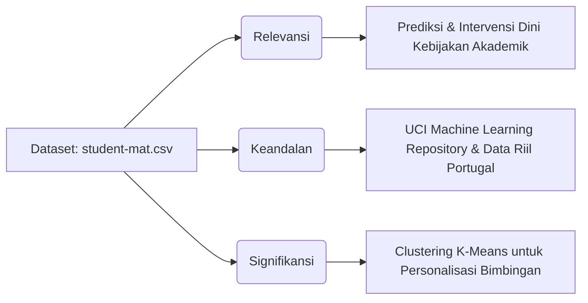

# 📊 PANDUAN PRESENTASI & ANALISIS MENDALAM: CLUSTERING PERFORMA SISWA (K-MEANS)
Repositori ini berisi panduan teknis, naskah presentasi, dan analisis mendalam untuk presentasi kelompok **2 orang** dengan durasi tepat **6 menit**. Analisis ini didasarkan pada file [analisis_clustering_performa_siswa.py](file:///c:/Users/Kaisha/Documents/!TUGAS%20KAISHA/semester%204/persentasi%20DATA%20MINING/analisis_clustering_performa_siswa.py) dengan dataset utama [student-mat.csv](file:///c:/Users/Kaisha/Documents/!TUGAS%20KAISHA/semester%204/persentasi%20DATA%20MINING/student-mat.csv).

---

## 🎯 Fondasi Analisis: Mengapa Memilih Data Ini?

Dosen meminta analisis yang teliti terkait relevansi, keandalan, dan signifikansi dataset dalam proyek ini. Berikut adalah argumentasi ilmiah mengapa dataset ini dipilih:



### 1. Relevansi (Relevance)
* **Konteks Masalah**: Pendidikan modern menghadapi tantangan besar dalam mendeteksi penurunan performa siswa sebelum semester berakhir. Identifikasi manual sering terlambat, berujung pada tingginya angka ketidaklulusan.
* **Kesesuaian Fitur**: Dataset ini memiliki atribut komprehensif yang menghubungkan aspek perilaku belajar (`studytime`), riwayat hambatan akademis (`failures`), disiplin kehadiran (`absences`), dan performa akademis berkala (`G1` UTS-1, `G2` UTS-2, `G3` Nilai Akhir).
* **Solusi**: Fitur-fitur ini sangat relevan untuk memetakan profil belajar siswa sehingga sekolah dapat mengambil tindakan pencegahan secara proaktif.

### 2. Keandalan (Reliability)
* **Sumber Kredibel**: Dataset ini diambil dari **UCI Machine Learning Repository**, repositori standar internasional untuk riset data mining.
* **Metode Pengumpulan**: Data dikumpulkan melalui laporan evaluasi sekolah resmi dan kuesioner terstruktur dari siswa di dua sekolah menengah atas di Portugal (Gabriel Pereira dan Mousinho da Silveira).
* **Kualitas Data**: Dataset bersih dari *missing values*, memiliki format terstruktur, dan memiliki ukuran sampel yang memadai (397 baris data) untuk menghasilkan model clustering K-Means yang stabil dan dapat dipertanggungjawabkan.

### 3. Signifikansi (Significance)
* **Dampak Kebijakan**: Pendekatan akademik konvensional sering memperlakukan semua siswa secara sama (generalisasi). Analisis clustering ini memecah generalisasi tersebut dengan menemukan sub-kelompok siswa tersembunyi (*student personas*).
* **Nilai Informasi**: Penemuan karakteristik cluster memberikan wawasan berharga bagi pembuat keputusan sekolah untuk merancang program bimbingan terarah (*targeted interventions*), mengalokasikan sumber daya konseling secara efisien, dan menaikkan tingkat kelulusan secara terukur.

---

## 👥 Struktur Pembagian Pembicara (Total Durasi: 6 Menit)

Presentasi dibagi menjadi 2 sesi utama dengan transisi yang cepat dan profesional untuk memenuhi batas waktu 6 menit.

| Waktu (Menit) | Durasi | Pembicara | Topik Utama | Slide Visual |
| :---: | :---: | :---: | :--- | :--- |
| **00:00 - 02:45** | 2 Menit 45 Detik | **Presenter 1** | Sambutan, Perkenalan, Latar Belakang, Relevansi Data, Fitur Seleksi & Penentuan Jumlah Cluster (Elbow Method) | Slide 1, 2, 3, 4 |
| **02:45 - 05:30** | 2 Menit 45 Detik | **Presenter 2** | Hasil Analisis Cluster, Visualisasi Scatter Plot, Rekomendasi Solusi Akademis | Slide 5, 6, 7 |
| **05:30 - 06:00** | 30 Detik | **Bersama** | Kesimpulan Akhir, Penutup, dan Sesi Tanya Jawab | Slide 8 |

---

## 🎙️ Naskah Presentasi Detail per Presenter

### 👤 PRESENTASI BAGIAN 1: Fondasi Riset & Penentuan Cluster (00:00 - 02:45)
* **Pembicara**: Presenter 1 (Kaisha)
* **Visual Pendukung**: Slide Judul, Poin Relevansi Data, & Grafik Elbow.

#### 📢 Naskah Opening & Sambutan Awal:
> "Selamat pagi/siang kami ucapkan kepada yang terhormat Bapak/Ibu Dosen Pengampu mata kuliah Data Mining, serta rekan-rekan mahasiswa yang kami banggakan. 
> 
> Perkenalkan, saya **Kaisha** bersama rekan saya, **[Nama Rekan]**, dari kelompok [Nama/Nomor Kelompok]. Hari ini, kami akan mempresentasikan hasil analisis clustering kami mengenai **'Segmentasi Performa Akademis Siswa Menggunakan Algoritma K-Means'** berdasarkan dataset *student-mat.csv*.
> 
> Mari kita mulai dengan alasan krusial mengapa kami memilih topik dan dataset ini."

#### 📢 Naskah Analisis Data & Metode:
> "Pendidikan yang sukses membutuhkan deteksi dini terhadap siswa yang mengalami kesulitan akademis. Dataset ini kami pilih karena memiliki tingkat **relevansi** yang tinggi antara variabel perilaku belajar seperti waktu belajar, absensi, dan nilai berkala G1, G2, dan G3. 
> 
> Dari segi **keandalan**, data ini bersumber dari UCI Repository yang berbasis pada performa nyata siswa di Portugal, menjamin analisis kami bebas dari bias data buatan. **Signifikansi** proyek ini terletak pada kemampuan clustering dalam mengelompokkan siswa ke dalam kelompok risiko akademik agar sekolah bisa melakukan intervensi sebelum siswa tersebut gagal.
> 
> Untuk melakukan pengelompokan ini, kami menyeleksi 6 fitur numerik utama: *studytime, failures, absences, G1, G2,* dan *G3*. Data ini terlebih dahulu kami standarisasi menggunakan *StandardScaler* agar perbedaan skala (seperti absensi yang bernilai puluhan dan kegagalan yang bernilai satuan) tidak mendominasi algoritma.
> 
> Langkah pertama kami adalah menentukan jumlah cluster terbaik (K) menggunakan **Metode Elbow**. Jika kita melihat visualisasi grafik Elbow di layar *(tunjuk gambar Grafik Elbow)*, nilai *inertia* menurun tajam dan mulai melandai secara signifikan setelah angka 3. Hal ini menunjukkan bahwa **K=3** adalah jumlah cluster paling optimal dan natural untuk membagi data siswa ini. Selanjutnya, rekan saya akan memaparkan temuan cluster ini."

---

### 👤 PRESENTASI BAGIAN 2: Hasil Analisis & Solusi (02:45 - 05:30)
* **Pembicara**: Presenter 2 ([Nama Rekan])
* **Visual Pendukung**: Tabel Karakteristik Cluster & Visualisasi Scatter Plot.

#### 📢 Naskah Hasil Analisis & Visualisasi:
> "Terima kasih, Kaisha. Setelah menjalankan algoritma K-Means dengan K=3, kami berhasil mengidentifikasi tiga kelompok siswa dengan karakteristik performa akademik yang sangat kontras:
> 
> Pertama, **Cluster 2 atau 'Siswa Berprestasi Tinggi'**. Kelompok ini memiliki waktu belajar tertinggi (2.17 jam), hampir tidak pernah gagal di masa lalu (0.08), tingkat absen rendah (3.93), dan nilai akhir G3 rata-rata sangat tinggi di angka **14.78** dari skala 20.
> 
> Kedua, **Cluster 0 atau 'Siswa Performa Menengah dengan Absensi Tinggi'**. Siswa di cluster ini sebenarnya memiliki waktu belajar yang cukup baik (2.06 jam) dan tingkat kegagalan yang rendah (0.11). Namun, mereka memiliki tingkat absensi rata-rata tertinggi, yaitu **7.63 kali**. Performa akademis mereka berada di tingkat menengah dengan nilai G3 rata-rata **9.55**, mendekati batas kelulusan.
> 
> Ketiga, **Cluster 1 atau 'Siswa Berisiko Tinggi'**. Ini adalah kelompok kritis yang membutuhkan perhatian penuh. Mereka memiliki waktu belajar terendah (1.67 jam) dan tingkat kegagalan masa lalu tertinggi mencapai rata-rata **1.53 kali**. Hasilnya, performa akademis mereka merosot tajam dari UTS G1 (7.19) ke nilai akhir G3 yang hanya mencapai **3.78**. Mereka berada di bawah garis kelulusan.
> 
> Visualisasi hubungan ini dapat kita lihat pada **Scatter Plot** di layar *(tunjuk visualisasi Scatter Plot)*. Titik kuning mewakili Cluster 2 yang berprestasi tinggi berkonsentrasi di sisi kanan nilai G3 (12-20). Titik ungu mewakili Cluster 0 (menengah) menyebar luas di bagian atas menunjukkan tingginya tingkat absensi mereka. Dan titik hijau/teal mewakili Cluster 1 (berisiko) berkumpul di sudut kiri bawah, menandakan nilai akhir rendah dengan tren performa akademik yang menurun drastis."

---

### 👥 KESIMPULAN & PENUTUP (05:30 - 06:00)
* **Pembicara**: Bersama / Presenter 2

#### 📢 Naskah Penutup & Solusi Akademik:
> "Berdasarkan temuan clustering ini, kami merekomendasikan solusi akademis yang terarah:
> 1. **Untuk Cluster 1 (Berisiko Tinggi)**: Sekolah wajib memberikan kelas remedial intensif, bimbingan belajar tambahan, serta konseling motivasi untuk menekan riwayat kegagalan mereka.
> 2. **Untuk Cluster 0 (Absensi Tinggi)**: Sekolah perlu menelusuri alasan di balik tingginya absensi siswa melalui pendekatan personal dan kerja sama dengan orang tua, guna menyelamatkan nilai mereka yang saat ini berada di batas kelulusan.
> 3. **Untuk Cluster 2 (Berprestasi)**: Program pengayaan dan apresiasi agar motivasi belajar mereka tetap terjaga.
> 
> Demikian presentasi hasil analisis data mining kami. Kami membuka sesi tanya jawab apabila ada tanggapan atau masukan dari Bapak/Ibu Dosen serta rekan-rekan sekalian. Terima kasih."

---

## 💻 Panduan Visual: Apa Saja yang Harus Ditampilkan?

Untuk meyakinkan dosen dan mempermudah pemahaman audiens dalam waktu 6 menit, gunakan susunan slide berikut:

```
[Slide 1: Judul & Anggota]  -->  [Slide 2: Relevansi & Keandalan] --> [Slide 3: Seleksi Fitur]
                                                                                |
[Slide 6: Rekomendasi/Solusi] <-- [Slide 5: Scatter Plot Hasil]  <-- [Slide 4: Grafik Elbow]
```

### 1. Slide 1: Judul dan Perkenalan
* **Isi**: Judul proyek, Nama Presenter (Kaisha & [Rekan]), Logo Universitas, Nama Mata Kuliah (Data Mining), dan Dosen Pengampu.
* **Aesthetic Tip**: Gunakan tema warna premium (seperti dark mode dengan aksen hijau emerald atau biru royal).

### 2. Slide 2: Latar Belakang & Alasan Pemilihan Data
* **Isi**: Poin-poin ringkas mengenai **Relevansi** (urgensi kegagalan siswa), **Keandalan** (kredibilitas UCI Repository), dan **Signifikansi** (dampak kebijakan berbasis data).

### 3. Slide 3: Seleksi Fitur & Preprocessing
* **Isi**: Penjelasan singkat mengapa memilih fitur: `studytime`, `failures`, `absences`, `G1`, `G2`, `G3`. Tampilkan diagram alir kecil bagaimana data distandarisasi (*StandardScaler*).

### 4. Slide 4: Metode Elbow (Penentuan Cluster)
* **Visual Utama**: Tampilkan plot dari file [Cuplikan layar 2026-06-22 225416.png](file:///c:/Users/Kaisha/Documents/!TUGAS%20KAISHA/semester%204/persentasi%20DATA%20MINING/Cuplikan%20layar%202026-06-22%20225416.png).
* **Highlight**: Lingkari area lekukan (*elbow point*) di K=3 untuk memperkuat alasan pemilihan 3 cluster.

### 5. Slide 5: Tabel Hasil Cluster & Profiling
* **Visual Utama**: Tabel ringkasan rata-rata yang sangat rapi:
  
  | Fitur Akademik / Perilaku | Cluster 2 (Berprestasi) | Cluster 0 (Absensi Tinggi) | Cluster 1 (Berisiko Tinggi) |
  | :--- | :---: | :---: | :---: |
  | **Waktu Belajar** | **2.17 jam** (Tinggi) | 2.06 jam (Sedang) | 1.67 jam (Rendah) |
  | **Tingkat Kegagalan** | 0.09 (Sangat Rendah) | 0.11 (Rendah) | **1.53** (Sangat Tinggi) |
  | **Rata-rata Absensi** | 3.93 kali (Rendah) | **7.63 kali** (Tinggi) | 3.64 kali (Rendah) |
  | **Nilai UTS-1 (G1)** | **14.54** | 9.59 | 7.19 |
  | **Nilai UTS-2 (G2)** | **14.55** | 9.66 | 5.77 |
  | **Nilai Akhir (G3)** | **14.78** (Lulus Sangat Baik) | **9.55** (Lulus Cukup) | **3.78** (Tidak Lulus) |

### 6. Slide 6: Visualisasi Scatter Plot K-Means
* **Visual Utama**: Tampilkan plot dari file [Cuplikan layar 2026-06-22 225447.png](file:///c:/Users/Kaisha/Documents/!TUGAS%20KAISHA/semester%204/persentasi%20DATA%20MINING/Cuplikan%20layar%202026-06-22%20225447.png).
* **Highlight**: Jelaskan sebaran warna cluster dan bagaimana korelasi visual antara nilai G3 dengan jumlah absen membantu mempertegas identitas tiap cluster.

### 7. Slide 7: Rekomendasi Tindak Lanjut Akademik (Solusi)
* **Isi**: Rekomendasi aksi nyata sekolah untuk masing-masing cluster (Remedial untuk Cluster 1, Pembinaan Absensi untuk Cluster 0, Program Pengayaan untuk Cluster 2).

---

> [!TIP]
> **Tips Sukses Presentasi 6 Menit:**
> 1. **Latih Transisi**: Saat Presenter 1 selesai menjelaskan grafik Elbow di Slide 4, langsung oper presentasi ke Presenter 2 dengan kalimat: *"Untuk memaparkan hasil clustering ini, silakan rekan saya [Nama Rekan] untuk melanjutkan."*
> 2. **Fokus pada Angka Kunci**: Dosen menyukai data riil. Sebutkan angka rata-rata G3 (14.78 vs 9.55 vs 3.78) secara jelas saat menjelaskan profil cluster.
> 3. **Posisikan Kursor dengan Baik**: Saat presentasi, gunakan laser pointer/kursor untuk menunjuk sumbu X (G3) dan sumbu Y (Absensi) pada Slide Scatter Plot.
